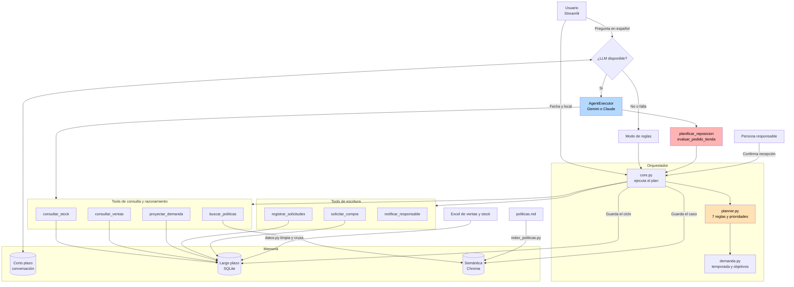
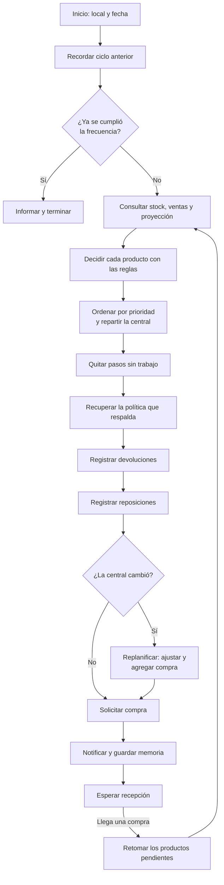
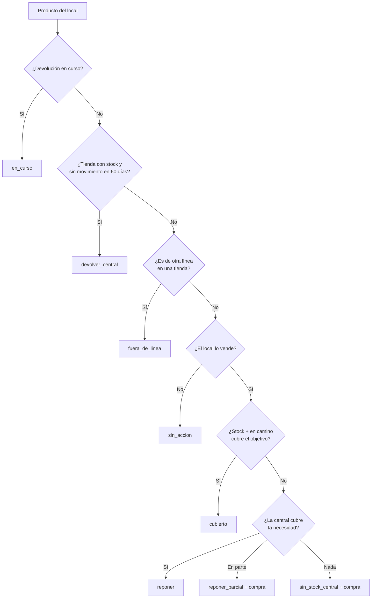

# Diagramas de orquestación

## Componentes

```mermaid
flowchart TD
    U[Usuario<br/>Streamlit] -->|Fecha y local| CORE
    U -->|Pregunta en español| CHAT{¿LLM disponible?}
    CHAT -->|Sí| LLM[AgentExecutor<br/>Gemini o Claude]
    CHAT -->|No o falla| REGLAS[Modo de reglas]
    LLM --> GATE[planificar_reposicion<br/>evaluar_pedido_tienda]
    LLM --> LECTURA
    REGLAS --> CORE
    GATE --> CORE

    subgraph AGENTE[Orquestador]
        CORE[core.py<br/>ejecuta el plan] --> PLAN[planner.py<br/>7 reglas y prioridades]
        PLAN --> DEM[demanda.py<br/>temporada y objetivos]
    end

    subgraph LECTURA[Tools de consulta y razonamiento]
        T1[consultar_stock]
        T2[consultar_ventas]
        T3[proyectar_demanda]
        T4[buscar_politicas]
    end

    subgraph ESCRITURA[Tools de escritura]
        T5[registrar_solicitudes]
        T6[solicitar_compra]
        T7[notificar_responsable]
    end

    CORE --> LECTURA
    CORE --> ESCRITURA

    subgraph MEMORIA[Memoria]
        M1[(Corto plazo<br/>conversación)]
        M2[(Largo plazo<br/>SQLite)]
        M3[(Semántica<br/>Chroma)]
    end

    CHAT <--> M1
    T1 & T2 & T3 --> M2
    T5 & T6 --> M2
    T4 --> M3
    CORE -->|Guarda el ciclo| M2
    CORE -->|Guarda el caso| M3

    ARCH[Excel de ventas y stock] -->|datos.py limpia y cruza| M2
    POL[politicas.md] -->|index_politicas.py| M3
    H[Persona responsable] -->|Confirma recepción| CORE

    style PLAN fill:#ffe1b3,color:#000
    style LLM fill:#b3d9ff,color:#000
    style GATE fill:#ffb3b3,color:#000
```

## Flujo de un ciclo de reposición

```mermaid
flowchart TD
    A[Inicio: local y fecha] --> B[Recordar ciclo anterior]
    B --> C{¿Ya se cumplió<br/>la frecuencia?}
    C -->|Sí| Z[Informar y terminar]
    C -->|No| D[Consultar stock, ventas y proyección]
    D --> E[Decidir cada producto con las reglas]
    E --> F[Ordenar por prioridad<br/>y repartir la central]
    F --> G[Quitar pasos sin trabajo]
    G --> H[Recuperar la política que respalda]
    H --> I[Registrar devoluciones]
    I --> J[Registrar reposiciones]
    J --> K{¿La central cambió?}
    K -->|Sí| L[Replanificar: ajustar y<br/>agregar compra]
    K -->|No| M[Solicitar compra]
    L --> M
    M --> N[Notificar y guardar memoria]
    N --> O[Esperar recepción]
    O -->|Llega una compra| P[Retomar los productos pendientes]
    P --> D
```

## Decisión por producto

```mermaid
flowchart TD
    A[Producto del local] --> B{¿Devolución en curso?}
    B -->|Sí| R0[en_curso]
    B -->|No| C{¿Tienda con stock y<br/>sin movimiento en 60 días?}
    C -->|Sí| R1[devolver_central]
    C -->|No| C2{¿Es de otra línea<br/>en una tienda?}
    C2 -->|Sí| R7[fuera_de_linea]
    C2 -->|No| D{¿El local lo vende?}
    D -->|No| R2[sin_accion]
    D -->|Sí| E{¿Stock + en camino<br/>cubre el objetivo?}
    E -->|Sí| R3[cubierto]
    E -->|No| F{¿La central cubre<br/>la necesidad?}
    F -->|Sí| R4[reponer]
    F -->|En parte| R5[reponer_parcial + compra]
    F -->|Nada| R6[sin_stock_central + compra]
```
